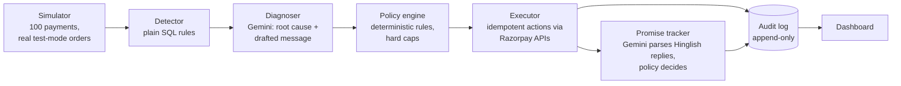

# Reclaim — AI Revenue Recovery Agent

**Razorpay Buildathon · Track 3 (AI Revenue Recovery)**

Merchants lose revenue quietly: a card declines, a UPI request times out, a
checkout gets abandoned — and usually nobody follows up. Reclaim is an agent
that finds that at-risk revenue, works out *why* each payment failed, chooses
a bounded intervention, executes it against Razorpay APIs, and reports every
rupee — recovered, escalated, or honestly written off — with a full audit
trail.

**Latest full batch:** ₹96,433 of ₹112,865 at-risk revenue recovered (85%)
across 100 payments · 6 escalated to a human · 1 written off because the
customer said no.

## Measured against the strategy merchants actually use

Same batch, same seeds, reproducible — the agent vs. blind auto-retry ×3
(no diagnosis, no timing, no listening):

| Metric | Reclaim agent | Blind retry ×3 |
|---|---:|---:|
| Recovered (clean) | **₹96,433 (85%)** | ₹50,601 (45%) |
| "Recovered" from suspected fraud — a chargeback time bomb | ₹0 | ₹7,382 |
| Attempts made | 66 | 108 |
| Retries against suspected fraud | 0 | 4 |
| Attempts on dead (expired) cards | 0 | 18 |
| Customer refusals honoured | 1 | 0 |

More money, fewer contacts, zero compliance violations. Reproduce it:
`python -m app.baseline` (assumptions documented in the file).

## How it works



The design rule of the whole system: **the LLM advises, deterministic code
decides and acts.** Money never moves on a model's say-so.

| Stage | AI? | Why |
|---|---|---|
| Detect at-risk payments | No — SQL | "Is this failed and unhandled?" is a set-membership question; an LLM adds cost and non-determinism for zero benefit |
| Diagnose root cause, draft customer message | **Gemini** | Gateway errors are messy free text; customer messages need language judgment |
| Choose & bound the intervention | No — policy rules | Hard rules: fraud is never auto-retried, amounts over ₹10k need human approval, max 3 attempts, unknown failure classes escalate |
| Execute (links, retries) | No — idempotent code | Every action has an idempotency key; a crash mid-action reconciles against Razorpay on restart, so nothing double-executes |
| Parse customer replies ("salary Friday ko aayegi...") | **Gemini** | Hinglish free text → structured intent + timeframe |
| Decide what a promise means | No — policy rules | ≤7-day promises tracked; refusals stop contact immediately; "already paid" claims go to a human — the agent never argues with a customer |

## Safety properties

- **Stopping rules** — 3 attempts max, then a human. One promise per payment.
  No retry loops, ever.
- **Timing is policy too** — insufficient-funds retries wait for the salary
  window (1st of the month), outage retries wait hours, link reminders are
  24h apart. When to act is decided by rules, with the rationale in the
  audit log.
- **A real seat for the human** — the escalation queue (`/escalations`) shows
  why the agent stopped on each case; a person's decision lands in the same
  audit trail as `actor: human`.
- **Tested invariants** — `python -m pytest` runs 42 tests proving the
  dangerous properties: fraud is never retried regardless of LLM output, the
  amount cap holds, attempt 4 never happens, crashes reconcile without
  duplicates, a refusal always stops contact.
- **Compliance over recovery rate** — a customer's "no" is honoured on the
  spot (written off, contact stops). Fraud-flagged payments are untouchable.
- **Crash safety** — actions are marked in-flight *before* any API call;
  on restart the executor reconciles them against Razorpay by reference id.
  Kill it mid-batch and restart: nothing is double-charged (see DEMO.md).
- **Total accountability** — an append-only audit log records every action by
  every component *with its reasoning*. The dashboard renders it per payment.
- **Privacy** — only the customer's first name is ever sent to the LLM.
- **Hardened against prompt injection** — a customer reply is
  attacker-controlled text. It is regex-screened for injection shape *before*
  any model call, fenced as untrusted data inside the prompt, and — because
  neither defence can be assumed perfect — autonomy is scaled to consequence:
  a promise merely pauses collection and stays automatic, while a refusal
  forfeits money and needs a human above ₹500. Found by attacking our own
  agent and succeeding; see [CHALLENGES.md](CHALLENGES.md) entry 7.
- **It knows what it costs** — the agent's own bill (LLM calls + outreach)
  is tracked: ₹11.60 total for this batch, about ₹0.01 per ₹100 recovered
  (`python -m app.roi`, assumptions in the file).
- **Webhook-first ingestion** — `POST /webhooks/razorpay` ingests
  `payment.failed` events and `payment_link.paid` confirmations with
  mandatory HMAC-SHA256 signature verification (constant-time compare,
  idempotent against Razorpay's redelivery). Polling is for demos; webhooks
  are how production hears about failures.

## What's real and what's simulated

Real: every order is a real Razorpay test-mode order; payment links were real
test-mode links until the account's lifetime cap of 30 was consumed, after
which the executor degrades gracefully to simulated delivery (disclosed
per-action in the audit trail). Simulated: payment *outcomes* — whether the
synthetic customer pays, replies, or keeps a promise — via seeded RNG,
because test mode has no humans in it. Nothing in the metrics hides this;
the seeds make every run reproducible.

## Run it

```bash
python -m venv .venv && .venv/Scripts/activate   # Windows
pip install -r requirements.txt
cp .env.example .env                             # add your keys

python -m app.simulator --count 100   # seed batch (real test-mode orders)
python -m app.detector                # flag at-risk revenue
python -m app.diagnoser --limit 50    # Gemini root-cause analysis
python -m app.policy                  # plan bounded interventions
python -m app.executor --loop --force-due  # execute (kill it mid-run — safe)
python -m app.promises --parse        # parse customer replies
python -m app.promises --resolve --force
python -m app.baseline                # compare vs blind-retry baseline
python -m pytest                      # 42 tests, incl. adversarial suite
uvicorn app.main:app --port 8100      # dashboard
```

Full walkthrough with the kill-and-resume demonstration: [DEMO.md](DEMO.md).

## What broke along the way

Six real incidents — rate limits, a rollback-vs-external-side-effect bug that
is exactly how double-charges happen, a hidden lifetime quota, and a
self-inflicted retry storm — each with what we learned:
**[CHALLENGES.md](CHALLENGES.md)**.

## Repo map

```
app/
  simulator.py   seed batch, real Razorpay orders, weighted failures
  detector.py    rule-based at-risk flagging
  diagnoser.py   Gemini diagnosis + message drafting
  policy.py      deterministic decision rules, hard caps, retry timing
  executor.py    idempotent execution, crash reconciliation, quota fallback
  promises.py    promise-to-pay: Gemini parsing + deterministic outcomes
  untrusted.py   screens attacker-controlled reply text before it reaches AI
  baseline.py    blind-retry baseline for the honest comparison
  roi.py         what the agent itself costs per rupee recovered
  main.py        FastAPI dashboard + escalation queue + signed webhooks
  db.py          SQLite schema incl. append-only audit log
  reset.py       wipe local state for a fresh demo
tests/           42 tests on the invariants that make this safe near money,
                 including an adversarial prompt-injection suite
```
